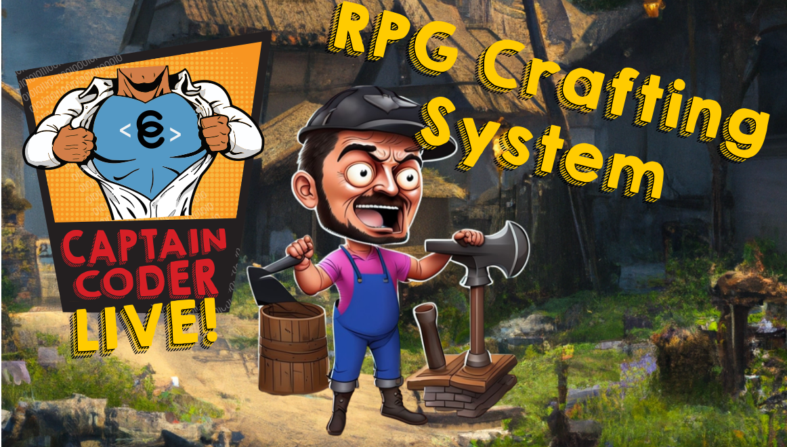

# Let's Make an RPG Crafting System
{: .no_toc }

Hello coders! Captain Coder here with another learning series. On the Captain
Coder's Academy discord, it was proposed that I implement a crafting system live
on stream. This site serves as a blog that chronicles the streams for anyone who
missed them live and recaps what we completed and learned each day. I hope someone
finds this blog useful!

* Archived Streams Playlist: [Playlist]
* Catch the Captain Live on Twitch: [Twitch]
* Source Code: [Repository]

## Day 1 - Design Document and Project Scope

The crew began work on the initial version of the Crafting System. We defined
our learning goals, created a design document, specified the scope of the
project, set up a new Unity project, and wrote a simple implementation of a
[ShapelessRecipe].

* [Read More]()
* [Watch On YouTube](https://youtube.com/live/_S4JNwdGPEo?feature=share)

## Day 2 - Using DLLs and Defining a Crafting Container

The crew continued work on the Crafting System. Today, we explored how to link
an external **DLL** within a Unity project, began the `CaptainCoder.Core`
library, defined the API for the [CraftingContainer] class, and began writing a
unit tests for [CraftingContainer].

* [Read More]()
* [Watch On YouTube](https://youtube.com/live/IA66jZh51h8)

## Day 3: Scriptable Objects and Recipe Database

Today, we finished an implementation of the [CraftingContainer].
Additionally, we took our first dive into `ScriptableObjects` by defining
scriptable object types for items, recipes, and recipe categories! Lastly, we
started work on an implementation of the [RecipeDatabase] class.

* [Read More]()
* [Watch On YouTube](https://youtube.com/live/6p3TJ3fbHe4)

## Day 4: Interfaces and Exploring UI Toolkit"

Today, we finished a implementing the `RecipeDatabase` class, refactored
the CraftingSystem to expose additional interfaces, implemented a
`CraftingContainerData` ScriptableObject, and began exploring using 
the UI Toolkit in play mode.

* [Read More]()
* [Watch On YouTube](https://youtube.com/live/N8lzDTX7_GM)

## Day 5: Drag and Drop Grid
{: .no_toc }

Today we finished implementing the UI Toolkit tutorial to create
a drag and drop inventory. Then, we refactored that implementation
to be linked with a CraftingContainer such that it renders a grid
with both valid and invalid positions.

* [Read More]()
* [Watch On YouTube](https://youtube.com/live/ifZe8YSKH_Y)

## Day 6: Combining Items in the UI
{: .no_toc }

Today we updated the Grid Container UI to contain locations for resulting
combined items to be displayed as well as add a button for combining.
Additionally, we wired up the UI to the Crafting System implementation from the
first 3 days of work. Lastly, we implemented a simple algorithm to scan assets
to generate the RecipeData ScriptableObject.

* [Read More]()
* [Watch On YouTube](https://youtube.com/live/4rftUYNikr8)

## Day 7: UI Cleanup

Today was the final day working on v0 of our Crafting System. We updated the
restyled the crafting container UI to scale with the size of the underlying
grid, added buttons to switch between crafting container types, and added a
simple item menu to allow the user to add and remove items in the crafting
container.

* [Read More]()
* [Watch On YouTube](https://youtube.com/live/610k0-rCQuU)

