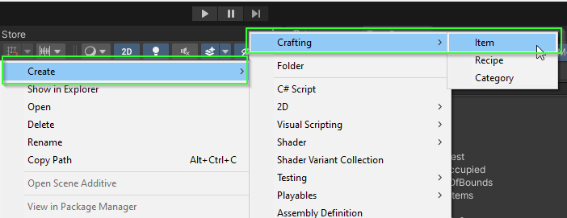
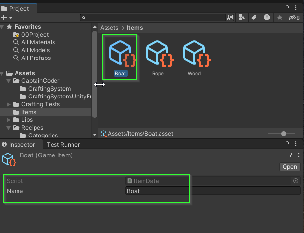

# Day 3: Scriptable Objects and Recipe Database
{: .no_toc }

Today, we finished a basic implementation of the `CraftingContainer`.
Additionally, we took our first dive into `ScriptableObjects` by defining
scriptable object types for items, recipes, and recipe categories! Lastly, we
started work on an implementation of the `RecipeDatabase class.

* [Watch On YouTube](https://youtube.com/live/6p3TJ3fbHe4)
* [Source Code at the End of Day 3](https://github.com/CaptainCoderOrg/CraftingSystem/tree/end-of-day-3)

<details open markdown="block">
  <summary>
    Table of contents
  </summary>
  {: .text-delta }
1. TOC
{:toc}
</details>

## Completing CraftingContainer

The first order of business was to finish writing tests and implementing the
`CraftingContainer` class from Day 2. This went quite smooth. The only "tricky"
code was the `TryMove` method below. I personally feel the method is a little
difficult to read and understand. It is designed to allow two positions within
the container to be swapped. It returns true if the state of the container has
changed after calling it and false otherwise. 

```csharp
  public bool TryMove(Position from, Position to)
  {
      // At least ONE position must have something
      if (!_grid.ContainsKey(from) && !_grid.ContainsKey(to)) { return false; }

      // If both spots are occupied, swap them
      if (_grid.ContainsKey(from) && _grid.ContainsKey(to))
      {
          (_grid[to], _grid[from]) = (_grid[from], _grid[to]);
      }
      else if (_grid.ContainsKey(from)) 
      {
          // If just from is occupied, move it.
          _grid[to] = _grid[from];
          _grid.Remove(from);
      }
      else
      {
          // If just to is occupied, move it.
          _grid[from] = _grid[to];
          _grid.Remove(to);
      }
      return true;
}
```

* The `CraftingContainer` source from Day 3 is available here: [LINK](https://github.com/CaptainCoderOrg/CraftingSystem/blob/end-of-day-3/RPG%20Crafting%20System/Assets/CaptainCoder/CraftingSystem/CraftingContainer.cs)
* The `CraftingContainerTest` source from Day 3 is available here: [LINK](https://github.com/CaptainCoderOrg/CraftingSystem/blob/end-of-day-3/RPG%20Crafting%20System/Assets/Crafting%20Tests/CaptainCoder/CraftingSystem/CraftingContainerTest.cs)


## Scriptable Objects

{:.note}
<b>Unity's Documentation</b>: A
[ScriptableObject](https://docs.unity3d.com/2022.2/Documentation/Manual/class-ScriptableObject.html)
is a data container that you can use to save large amounts of data, independent
of class instances. One of the main use cases for ScriptableObjects is to reduce
your Project’s memory usage by avoiding copies of values. This is useful if your
Project has a Prefab that stores unchanging data in attached MonoBehaviour
scripts.

### ItemData

After completing the `CraftingContainer` class, I wanted to see how I might be
able to use the `ShapelessRecipe` class within a Unity project. I started by
adding an assembly specifically for the portions of the code that would rely on
`UnityEngine` libraries. 

Within the assembly, I created my first ScriptableObject which will be an
implementation of the `IItem` interface specified within
`CaptainCoder.CraftingSystem`:

```csharp
[System.Serializable]
[CreateAssetMenu(fileName = "Item", menuName = "Crafting/Item", order = 0)]
public class ItemData : ScriptableObject, IItem
{
    [field: SerializeField]
    private string Name { get; private set; }
}
```

* We chose to use the convention that all ScriptableObject implementations will
end with the name `Data` and thus the class is named `ItemData`.

* The `CreateAssetMenu` attribute allow us to create instances of the `GameItem` using 
the Unity menu in the Project Explorer.



* Additionally, because we specified the `[field: SerializeField]` attribute on
the `Name` property, we can modify it in the Inspector.



### CraftingCategoryData

Additionally, we created a wrapper ScriptableObject for `CraftingCategory`: `CraftingCategoryData`:

```csharp
[CreateAssetMenu(fileName = "CraftingCategory", menuName = "Crafting/Category", order = 2)]
public class CraftingCategoryData : ScriptableObject
{
    [field: SerializeField]
    public string Name { get; private set; }
    public CraftingCategory AsStruct => new (Name);
}
```

Because `CraftingCategory` is not an interface, the `CraftingCategoryData` I
added a method `AsStruct` which converts the `CraftingCategoryData` into a
`CraftingCategory`. It might make sense to write a `ICraftingCategory` interface
instead. Doing so would be more modular and consistent with how `IItem` works.

### ShapelessRecipeData

Next, it was time to create a ScriptableObject which has enough information to
create a `ShapelessRecipe`. Recall that the `ShapelessRecipe` requires 3
components: a list of ingredients, a `CraftingCategory` and a list of resulting
items. Additionally, the `ShapelessRecipe` class uses a generic type:
`ShapelessRecipe<T> where T : IItem`. This was intentional to allow for the `T`
type to be Serializeable using Unity's serialization tools.

A generic `ShapelessRecipeData<T>` was written to mimic the `ShapelessRecipe` class:

```csharp
public class ShapelessRecipeData<T> : ScriptableObject where T : IItem
{
    [field: SerializeField]
    public List<T> Ingredients { get; private set; }
    [field: SerializeField]
    public CraftingCategoryData Category { get; private set; }
    [field: SerializeField]
    public List<T> Results { get; private set; }
    public ShapelessRecipe<T> AsRecipe => new (Ingredients, Category.AsStruct, Results);
}
```

Once again, it might make more sense to have an `IShapelessRecipe<T>` interface
rather than providing an `AsRecipe` method.

{:.note}
Because the `ShapelessRecipeData<T>` is generic, it isn't possible to edit them
in the inspector. Thus, I did not include a `CreateAssetMenu` attribute.

Lastly, I extended the `ShapelessRecipeData` class specifying I would like to
use `ItemData` as my concrete `IItem` type:

```csharp
[CreateAssetMenu(fileName = "Recipe", menuName = "Crafting/Recipe", order = 1)]
public class GameRecipeData : ShapelessRecipeData<ItemData> {} 
```

By specifying the concrete type as a `Serializable` type, we can create and edit
`GameRecipeData`s directly in the inspector.

<video autoplay="true" loop="true">
  <source src="../imgs/boat-recipe.webm" type="video/webm">
</video>

**LEARNING GOAL #1 ACHIEVED**

Learning Goal #1: Learn about Scriptable Objects!

## RecipeDatabase

With just a small amount of time left at the end of the coding session, I
attempted to implement a `RecipeDatabase` class. The goal of this class is to
allow quick lookup of a recipe given ingredients and a `CraftingCategory`. I defined
the following API:

```csharp
public class RecipeDatabase<T> where T : IItem
{
  /// <summary>
  /// Retrieves the recipe associated with the specified set of ingredients and category. If one is found, the recipe
  /// value is set and the method returns true. Otherwise, the value of recipe is undefined and the method returns false.
  /// </summary>
  public bool TryGetRecipe(IEnumerable<T> ingredients, CraftingCategory category, out ShapelessRecipe<T> recipe);
}
```
I'm not yet sure how a `RecipeDatabase` will be constructed BUT I know for sure
that I should not need to iterate through all possible recipes to find the
matching `ShapelessRecipe`. Additionally, the order of the specified ingredients
should not matter. For example, a "wood, wood, rope" should produce the same recipe
as "rope, wood, wood" or "wood, rope, wood".

To accomplish this, I began implementing a `RecipeEntry` class:

```csharp
public class RecipeEntry
{
    private readonly Dictionary<T, int> _itemCounts = new();
    private readonly CraftingCategory _category;
    private readonly int _hashCode;

    public RecipeEntry(IEnumerable<T> ingredients, CraftingCategory category);
    public override bool Equals(object obj);
    public override int GetHashCode() => _hashCode;
}
```

The idea with the `RecipeEntry` is to use it as a key in a
`Dictionary<RecipeEntry, ShapelessRecipe>`.

To ensure the `GetHashCode()` returns the proper key regardless of the order of
`ingredients`, I initialize it by summing the hash codes of each ingredient and
combine that value with the hash code of the category:

```csharp
public RecipeEntry(IEnumerable<T> ingredients, CraftingCategory category)
{
    _hashCode = 0;
    foreach(T item in ingredients)
    {
        _hashCode += item.GetHashCode();
    }
    _category = category;
    _hashCode = HashCode.Combine(_hashCode, _category);
}
```

This should be enough to ensure that the keys match within a dictionary. 

Next, we needed to override the `Equals` method to ensure the order doesn't
matter. To do this, I use the `Dictionary<T, int> _itemCounts;` field to track
the count of each type of ingredient. Two RecipeEntry's will be equal if their
hash codes match, they have the same category, and the key/value sets of
`_itemCounts` match. Unfortunately, we didn't quite have enough time to finish
this implementation.

We made a great amount of progress today! But, with only 4 days left... is there
enough time to finish the first version of this system? Only time will tell!

