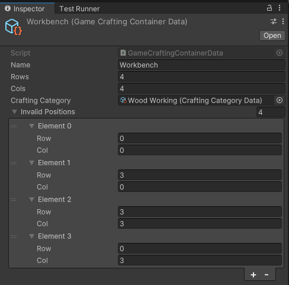
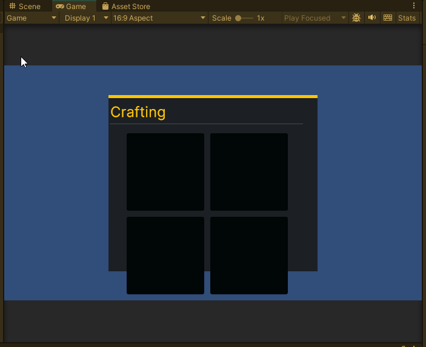

# Day 4: Interfaces and Exploring UI Toolkit
{: .no_toc }

Today, we finished implementing the `RecipeDatabase` class, refactored
the CraftingSystem to expose additional interfaces, implemented a
`CraftingContainerData` ScriptableObject, and began exploring using 
the UI Toolkit in play mode.

* [Watch On YouTube](https://youtube.com/live/N8lzDTX7_GM)
* [Source Code at the End of Day 4](https://github.com/CaptainCoderOrg/CraftingSystem/tree/end-of-day-4)

<details open markdown="block">
  <summary>
    Table of contents
  </summary>
  {: .text-delta }
1. TOC
{:toc}
</details>

## Today's Goals

1. <s>Finish RecipeDatabase Class</s>
2. <s>Write simple interface for each type that must be implemented</s>
3. <s>Implement a CraftingContainerData ScriptableObject</s>
4. Implement CraftingContainerGrid MonoBehaviour (Started!)

## Finishing the RecipeDatabase Class

The first order of business was to complete the `RecipeDatabase` class that we
started on Day 3. As a quick reminder, the `RecipeDatabase` provides the following
API:

```csharp
/// <summary>
/// Given ingredients and a category, attempts to find a recipe in the database.
/// If one is found, returns true and populates recipe. Otherwise, returns false
/// and the value of recipe is undefined.
/// </summary>
public bool TryGetRecipe(IEnumerable<T> ingredients, ICraftingCategory category, out IShapelessRecipe<T> recipe);
```

One of the primary goals from the original scope document is to have an
efficient implementation of this method. That is, this method should not iterate
over all possible recipes.

To accomplish this, we defined a nested `RecipeEntry` class which generates a
hash code based on the ingredients and category such that the order of the
ingredients is not important. Additionally, we implemented an `Equals` such
that two `RecipeEntry`'s are considered equal if they contain the same ingredients
regardless of order:

```csharp
public class RecipeEntry
{
    // This dictionary is a table which tracks the number of each ingredient
    // in this recipe.
    private readonly Dictionary<T, int> _itemCounts = new();
    private readonly ICraftingCategory _category;
    private readonly int _hashCode;

    public RecipeEntry(IEnumerable<T> ingredients, ICraftingCategory category)
    {
        _hashCode = 0;
        foreach(T item in ingredients)
        {
            // We sum the hashcode of each ingredient. This ensures
            // the hashcode of any permutation of the ingredients will match
            _hashCode += item.GetHashCode();

            // Additionally, we build up a Dictionary that counts the number of
            // each ingredients.
            if(!_itemCounts.ContainsKey(item))
            {
                _itemCounts[item] = 1;
            }
            else
            {
                _itemCounts[item]++;
            }
        }
        _category = category;
        // The final hashcode should also take into account the category
        _hashCode = HashCode.Combine(_hashCode, _category);
    }

    public override bool Equals(object obj)
    {
        return obj is RecipeEntry entry &&
                // First check that the hash codes match
                _hashCode == entry._hashCode &&
                // Just in case of a hash collision, ensure that the categories are the same
                _category.Equals(entry._category) && 
                // Lastly, we must do a deep compare of the two dictionaries
                // This must iterate through the dictionary and is the most inefficient
                // part of the algorithm.
                _itemCounts.KeyValuePairEquals(entry._itemCounts);
    }

    // We return the pre-cached hashCode
    public override int GetHashCode() => _hashCode;
}
```

Checking the equality of two `RecipeEntry`s requires us to check if the
ingredient counts are identical. This is because there is a possibility of a
hash collision upon looking up the value in a dictionary or hash set.

To perform this check, we added a static `DictionaryExtensions` class to the
`CaptainCoder.Core` library, that contains a `KeyValuePairEquals` method for
performing a deep compare of two `Dictionary`s:

```csharp
/// <summary>
/// Performs a deep comparison of all key value pairs in <paramref name="dict0"/> and <paramref name="dict1"/>.
/// </summary>
public static bool KeyValuePairEquals<K,V>(this Dictionary<K,V> dict0, Dictionary<K,V> dict1)
{
    // First check if the count is the same. If it is not, no need to waste time checking all entries
    if (dict0.Count != dict1.Count) { return false; }

    // If the counts match, we need to compare all entries
    foreach((K key, V value) in dict0)
    {
        // If we encounter any key in one dictionary that is not in the other, we return false
        if (!dict1.TryGetValue(key, out V other)) { return false; }
        
        // If a key returns null on both dictionaries,
        // they match and we continue (can't call null.Equals)
        if (value == null && other == null) { continue; }

        // Lastly, we check for equality here. If equality fails,
        // we return false.
        if (value == null || !value.Equals(other)) { return false; }
    }
    return true;
} 
```

## Adding Simple Interfaces

On Day 3, we began to explore how we could use ScriptableObjects to define our
recipes, items, and crafting containers. For example, the
`CraftingContainerData` from Day 3 looked like this:

```csharp
[CreateAssetMenu(fileName = "CraftingCategory", menuName = "Crafting/Category", order = 2)]
public class CraftingCategoryData : ScriptableObject
{
    [field: SerializeField]
    public string Name { get; private set; }
    public CraftingCategory AsStruct => new (Name);
}
```

Yesterday, I noted that the `AsStruct` method felt gross to me and that it might
make sense to create an `ICraftingCategory`. Doing so would allow us to pass
the `CraftingCategoryData` directly into the Crafting System library rather than
being required to provide an `AsStruct`. From a reusability stand point, I feel
this makes for a better user experience. Thus, we created a few interfaces and 
refactored the Crafting System code to use them:

```csharp
public interface ICraftingCategory
{
    public string Name { get; }
}
```

```csharp
public interface IShapelessRecipe<T> where T : IItem
{
    public IEnumerable<T> Ingredients { get; }
    public IEnumerable<T> Result { get; }
    public ICraftingCategory Category { get; }
}
```

```csharp
public interface ICraftingContainer<T> where T : IItem
{
    public int Rows { get; }
    public int Columns { get; }
    public HashSet<ICraftingCategory> Categories {get; }
    public HashSet<Position> InvalidPositions  { get; }
    public IEnumerable<(Position, T)> Positions { get; }
    public bool TryAddItem(Position position, T item);
    public bool TryMove(Position from, Position to);
    public bool TryRemove(Position position, out T removed);
    public bool TryItemAt(Position position, out T result);
    public T ItemAt(Position position);
    public bool HasItemAt(Position position);
}
```

Next, we updated each of the associated types to implement these interfaces.

## Implement a CraftingContainerData ScriptableObject

With the `ICraftingContainer` interface available, we next implemented a
scriptable object version: `CraftingContainerData`. The class signature looks
like this:

```csharp
public class CraftingContainerData<T> : ScriptableObject, ICraftingContainer<T> where T : IItem {}
```

You may recall that we implemented the functionality of `ICraftingContainer` in
the `CraftingContainer` class on Day 3. But, we cannot extend it here because we
are already extending `ScriptableObject`. However, we would like to reuse that
functionality without copy / pasting the code. To accomplish this, we want to
use a delegate field and forward all of the interface methods to an
implementation:

```csharp
public class CraftingContainerData<T> : ScriptableObject, ICraftingContainer<T> where T : IItem
{
    // We will do some magic with this "Delegate" property soon.
    // For now, assume it is a concrete implementation
    private ICraftingContainer<T> Delegate { get; } 

    // If we are able to set the Delegate properly, we can just forward
    // the responsibility to it for each of these methods
    public int Rows => Delegate.Rows;
    public int Columns => Delegate.Columns;
    public HashSet<ICraftingCategory> Categories => Delegate.Categories;
    public HashSet<Position> InvalidPositions => Delegate.InvalidPositions;
    public IEnumerable<(Position, T)> Positions => Delegate.Positions;
    public bool HasItemAt(Position position) => Delegate.HasItemAt(position);
    public T ItemAt(Position position) => Delegate.ItemAt(position);
    public bool TryAddItem(Position position, T item) => Delegate.TryAddItem(position, item);
    public bool TryItemAt(Position position, out T result) => Delegate.TryItemAt(position, out result);
    public bool TryMove(Position from, Position to) => Delegate.TryMove(from, to);
    public bool TryRemove(Position position, out T removed) => Delegate.TryRemove(position, out removed);
}
```

In the inspector, we would like to be able to specify the values necessary to construct a concrete `CraftingContainer`:

```csharp
public class CraftingContainerData<T> : ScriptableObject, ICraftingContainer<T> where T : IItem
{
  [field: SerializeField]
  public string Name { get; private set; }
  [SerializeField]
  private int _rows;
  [SerializeField]
  private int _cols;
  [SerializeField]
  private CraftingCategoryData _craftingCategory;
  [SerializeField]
  private List<InvalidPosition> _invalidPositions;


  // The CaptainCoder.Core.Position is a readonly struct that cannot be displayed in the 
  // Unity inspector so we implement a very simple wrapper for it.
  [System.Serializable]
  internal struct InvalidPosition
  {
      public int Row;
      public int Col;
  }
}
```

And lastly, we implement the `Delegate` getter such that it initializes once at runtime based on the values specified in the inspector:

```csharp
public class CraftingContainerData<T> : ScriptableObject, ICraftingContainer<T> where T : IItem
{
  // Actual backing field
  private ICraftingContainer<T> _delegate;
  private ICraftingContainer<T> Delegate
  {
      get
      {
        // First time we try to access the delegate we initialize it
          if (_delegate == null) 
          {
              _delegate = new CraftingContainer<T>(
                  _rows, 
                  _cols, 
                  _craftingCategory, 
                  _invalidPositions.Select(pos => new Position(pos.Row, pos.Col)));
          }
          return _delegate;
      }
  }
}
```

### Implementing a Concrete CraftingContainerData

Similar to `ShapelessRecipeData<T>` the `CraftingContainerData<T>` class uses a
generic type and thus cannot be instantiated directly in the inspector. To do this,
we create a very simple concrete implementation `GameCraftingContainerData.cs`:

```csharp
[CreateAssetMenu(fileName = "Container", menuName = "Crafting/Container", order = 3)]
public class GameCraftingContainerData : CraftingContainerData<ItemData> { }
```

And just like magic, we can now specify a variety of crafting containers
directly in Unity.



## Start Work on UI

At this point, I believe we have the majority of the Crafting System logic
finished. All that seems to be left is to create a UI and hook it all up.

My last learning goal is to learn how to use the new UI Toolkit in play mode.
Thus, we began delving into using it. Luckily,
[MooNiZZ](https://www.twitch.tv/moonizz) was watching and recommended a tutorial
on making a grid based inventory (hey! That sounds very similar to what we
want!).

We followed along with this tutorial: [LINK](https://gamedev-resources.com/create-an-in-game-inventory-ui-with-ui-toolkit/)

We didn't finish yet, but we have the start of a crafting UI that we shall continue working on tomorrow:



Whew! We made it! Looking forward to continuing this tomorrow!

