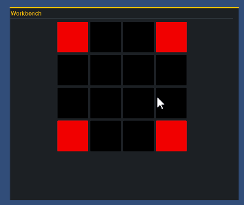

# Day 5: Drag and Drop Grid
{: .no_toc }

Today we finished implementing the UI Toolkit tutorial to create
a drag and drop inventory. Then, we refactored that implementation
to be linked with a CraftingContainer such that it renders a grid
with both valid and invalid positions.

* [Watch On YouTube](https://youtube.com/live/ifZe8YSKH_Y)
* [Source Code at the End of Day 5](https://github.com/CaptainCoderOrg/CraftingSystem/tree/end-of-day-5)

<details open markdown="block">
  <summary>
    Table of contents
  </summary>
  {: .text-delta }
1. TOC
{:toc}
</details>

## Today's Goals

1. <s>Finish Inventory Drag and Drop Tutorial</s>
2. <s>Update Grid to display based on Crafting Container Grid</s>

## Finishing Inventory Drag and Drop Tutorial

Recall from Day 4 that we began to learn about how to use the new UI Toolkit to
create a rich user interface. To do this, we followed a tutorial on creating a 
grid based, drag and drop inventory: [LINK](https://gamedev-resources.com/create-an-in-game-inventory-ui-with-ui-toolkit/)

Of course, Captain Coder doesn't just follow a tutorial! Instead, we made it our
own. To do this, we first used Leonardo.AI to generate a few assets for us which
would represent the Boat, Wood, and Rope items we created using ScriptableObjects:


Next, we added a `Sprite` property to the `ItemData` ScriptableObject:

```csharp
public class ItemData : ScriptableObject, IItem
{
    [SerializeField]
    private string _name;
    public string Name => _name;

    [field: SerializeField]
    public Sprite Sprite { get; private set; }
}
```

With a serialized `Sprite` property, we were able to specify the sprite for each instance of ItemData:

<video autoplay="true" loop="true">
  <source src="../imgs/rope.webm" type="video/webm">
</video>

As a quick hack to continue working on the grid, we implemented a very simple
`ItemDatabase` ScriptableObject that had a reference to each of the `ItemData`
instances we created:

```csharp
public class ItemDatabase : ScriptableObject
{
    [field: SerializeField]
    public ItemData Boat { get; private set; }
    [field: SerializeField]
    public ItemData Rope { get; private set; }
    [field: SerializeField]
    public ItemData Wood { get; private set; }
}
```

With this defined, we were able to hard code the interface to populate such that the first
three cells contained the items:

<video autoplay="true" loop="true">
  <source src="../imgs/inventory-tutorial.webm" type="video/webm">
</video>

For a full explanation on how this works, you can follow the tutorial here: [LINK](https://gamedev-resources.com/create-an-in-game-inventory-ui-with-ui-toolkit/)

## Update UI to Display a Crafting Container Grid

Recall from day 1 that we would like to have Crafting Containers that
have arbitrary 2D grid shapes (e.g. InvalidPositions). On day 4, we
created an instance of the `CraftingContainerData` ScriptableObject
for a "Wood Working" station that is a 4x4 grid such that each corner of the grid cannot be used for crafting.

We modified the code to include a reference to a `CraftingContainerData` that is used in the UI's `Awake` method to
construct the `GridSlot`s and specify if the slot is invalid:

```csharp
public class CraftingContainerUIController : MonoBehaviour
{
  private void Awake()
  {
    // Acquire the set of invalid positions
    HashSet<Core.Position> invalidPositions = CraftingContainer.InvalidPositions;
    for (int r = 0; r < CraftingContainer.Rows; r++)
    {
        // Creates a row for each row in the CraftingContainer
        GridRow row = new ();
        // and adds it to the UI
        m_SlotContainer.Add(row);
        for (int c = 0; c < CraftingContainer.Columns; c++)
        {
            // Construct a GridSlot specifying if it is invalid or valid
            GridSlot slot = 
              invalidPositions.Contains(new Core.Position(r,c)) ? new GridSlot(true) : new GridSlot();
            GridSlots.Add(slot);
            // and add it to the row
            row.Add(slot);
        }
    }
}
```

Additionally, we added a styling for the GridSlot when it is valid / invalid.
The result can be seen below:



With a much better understanding of the new UI Toolkit, we are ready to wire up
our crafting system in the next two days! We are super close!

