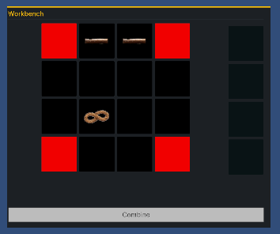

# Day 6: Combining Items in the UI
{: .no_toc }

Today we updated the Grid Container UI to contain locations for resulting
combined items to be displayed as well as add a button for combining.
Additionally, we wired up the UI to the Crafting System implementation from the
first 3 days of work. Lastly, we implemented a simple algorithm to scan assets
to generate the RecipeData ScriptableObject.

* [Watch On YouTube](https://youtube.com/live/4rftUYNikr8)
* [Source Code at the End of Day 6](https://github.com/CaptainCoderOrg/CraftingSystem/tree/end-of-day-6)

<details open markdown="block">
  <summary>
    Table of contents
  </summary>
  {: .text-delta }
1. TOC
{:toc}
</details>

## Today's Goals

1. <s>Update Grid container UI to have Output Slots and Button (Combine)</s>
2. <s>Wire up UI Grid to use a Recipe Database and perform combine</s>
3. <s>Implement RecipeDatabaseBuilder which scans for Recipe assets</s>

## Update Grid container UI to have Output Slots and Button (Combine)

First order of business was to update the UI to have Output Slots and a Button
that will eventually perform the combine:



## Wire up UI Grid to use a Recipe Database

Next, we needed to wire up the logic to properly enforce swapping of items when
moving them and enforcing the items stay in bounds. Additionally, when clicking
combine, the resulting combine should appear in the output area.

<video autoplay="true" loop="true">
  <source src="../imgs/combine-example-2.webm" type="video/webm">
</video>

## Implement a RecipeDatabase Scanner

Lastly, we  wanted to make it easy to add all recipes defined within a file
structure to be added to the RecipeDatabase automagically. To do this, we wrote
a validation script which scans the directory structure near the RecipeDatabase
for RecipeData.

```csharp
public void OnValidate()
{
    if (ScanForRecipes)
    {
        string[] pathEl = AssetDatabase.GetAssetPath(this).Split("/");
        string path = string.Join("/", pathEl.Take(pathEl.Length - 1));
        Recipes = AssetDatabase
            .FindAssets($"t:{nameof(GameRecipeData)}", new[]{path})
            .Select(AssetDatabase.GUIDToAssetPath)
            .Select(AssetDatabase.LoadAssetAtPath<GameRecipeData>).ToList();
        ScanForRecipes = false;
    }
}
```

The `OnValidate` is triggered when changes are made in the inspector. Using the
a bool `ScanForRecipes`, there is a checkbox that can be clicked that scans the
assets within the sub directory containing this database for `GameRecipeData`
assets and updates the list:

<video autoplay="true" loop="true">
  <source src="../imgs/item-database-example.webm" type="video/webm">
</video>

We made tons of progress today! In fact, at this point, we completed all of our
learning goals and scope requirements. All that is left is to clean up the UI.


