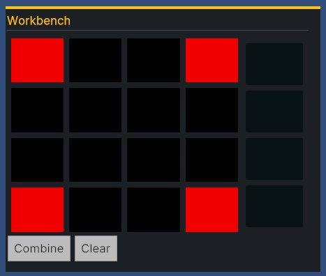
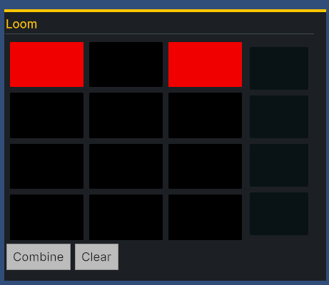
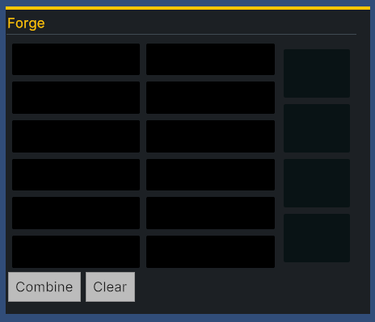

# Day 7: Cleanup UI
{: .no_toc }

Today was the final day working on v0 of our Crafting System. We updated the
restyled the crafting container UI to scale with the size of the underlying
grid, added buttons to switch between crafting container types, and added a
simple item menu to allow the user to add and remove items in the crafting
container.

* [Watch On YouTube](https://youtube.com/live/610k0-rCQuU)
* [Source Code at the End of Day 7](https://github.com/CaptainCoderOrg/CraftingSystem/tree/end-of-day-7)

<details open markdown="block">
  <summary>
    Table of contents
  </summary>
  {: .text-delta }
1. TOC
{:toc}
</details>

## Today's Goals

1. <s>Restyle Crafting Container UI to scale with grid size</s>
2. <s>Add buttons to switch between Crafting Container types</s>
3. <s>Add "simple" inventory to allow adding / removing items</s>

## Scale Crafting Container with Grid Size

On Day 6, we finished with a functional crafting container that loads the grid
based on the specified `CraftingContainer` and allows the user to combine the
contents. However, the UI was horrifically bad because it did not properly scale
with the users resolution. This resulted in the grid extending beyond the bounds
of its container as well as the fonts scaling awkwardly.

After much research, a member of the crew pointed out that the `PanelSettings`
of a `UIDocument` could specify a `ScaleMode` that allowed us to work within a
specific resolution and scale appropriately:

<video autoplay="true" loop="true">
  <source src="../imgs/scale-mode.webm" type="video/webm">
</video>

This solved the problem with the grid overflowing when the resolution was too
small. However, it did not prevent the grid from growing beyond the size of the
UI if it contained too many rows or columns. To solve this, we utilized the
 `flex-grow` and `flex-basis` styling in our USS to enforce that each row had
the same height and each cell within the rows had the same width:


```css
.flex-grid-element {
    flex-grow: 1; /* row/column will grow with a weight of 1 */
    flex-basis: 0; /* Contents of the grid are ignored */
}
```

This looks reasonable when the rows and columns are similar in size:





However, not so much when the shape is more rectangular:



In the future, I would definitely like to fix this and find a convenient way to
force the grid to be square without the need to specify a width / height.

## Dynamically Switching Containers

At this point, the UI was rendered based on the Crafting Container specified in
the inspector and could not be changed during play. The next step was to add
buttons that allowed us to set the Crafting Container at runtime and dynamically
draw the grid to the screen.

To do this, we created a new UXML document `CraftingContainerSelector` which is
a very simple flow container for buttons. Additionally, we wrote a MonoBehaviour
specifying the possible CraftingContainers that could be selected and upon
Awaking, the appropriate buttons are added to the UI:

```csharp
public class CraftingContainerSelector : MonoBehaviour
{
  [SerializeField]
  private List<GameCraftingContainerData> _craftingContainers;
  [SerializeField]
  private CraftingContainerUIController _craftingController;
  private void Awake()
  {
      VisualElement root = GetComponent<UIDocument>().rootVisualElement;
      VisualElement containerEl = root.Q<VisualElement>("Container");
      foreach (GameCraftingContainerData container in _craftingContainers)
      {
          Button button = new() { text = container.Name };
          containerEl.Add(button);
          button.clicked += () => _craftingController.SetCraftingContainer(container);
          button.SetEnabled(true);
      }
  }
}
```

With this in place, we added each of our predefined crafting container scriptable objects
to the `CraftingContainerSelector` in the inspector and it worked like magic!

<video autoplay="true" loop="true">
  <source src="../imgs/switch-containers.webm" type="video/webm">
</video>

## Add Item Buttons to UI

To be able to test the crafting containers, we needed the ability to dynamically
add items during play mode. To do this, we created yet another UI
`FakeInventorySelector` which was almost identical to the
`CraftingContainerSelect` except it had buttons which would add an item to the
currently selected container. After doing this, we could add items to
containers, drag the about, attempt combining them, and marvel in our simple
crafting system:

<video autoplay="true" loop="true">
  <source src="../imgs/doing-combines.webm" type="video/webm">
</video>

And with that, we had a very simple working crafting system!

